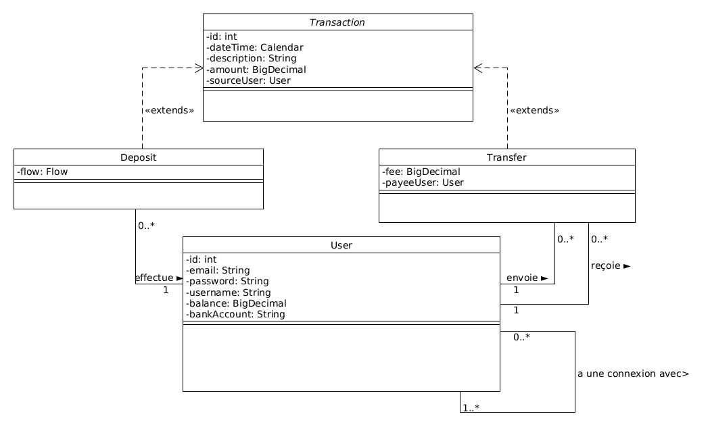
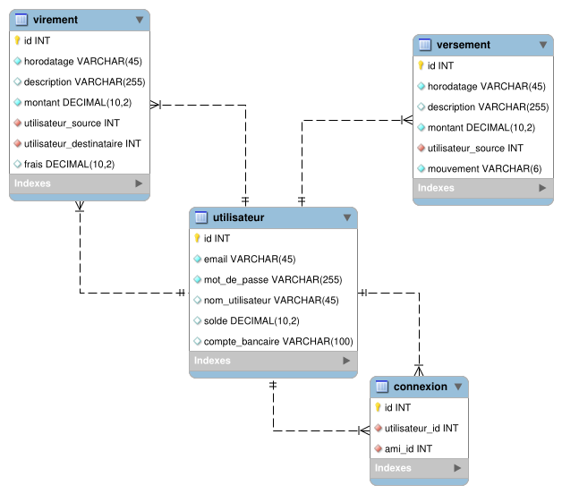

# PayMyBuddy

Easy Money Transfering App

##Table of contents
1. [General Info](#general-info)
2. [Deliverable: UML Diagram](#uml-diagram)
3. [Deliverable: Data Physical Model](#data-physical-model)
4. [SQL Scripts](#dbs-creation-scripts)
5. [Technologies](#technologies)
6. [Installation](#installation)

##General Info

Project prototype for PayMyBuddy
Project 6 of Java Application Developper Course

##Uml Diagram

##Data physical model

##Dbs creation scripts

[DB Scripts](https://github.com/BenCorpro/PayMyBuddy/tree/main/resources)

##Technologies

* [Java](https://www.oracle.com/java/technologies/downloads/): Version 17
* [MySQL](https://dev.mysql.com/downloads/mysql/): Version 8.0.28
* [Spring](https://start.spring.io/): Version 2.6.4
* Spring Web, Spring Data JPA, MySQL Connector, Spring Security and Thymeleaf

##Installation

* Clone the repository: git clone https://github.com/BenCorpro/PayMyBuddy

* Get into the project folder: cd ../path/to/the/file

* Package the application: mvn clean package DskipTests=true (to skip the tests since tests needs connection to a test database, and properties are externalized)

* Copy the application.properties file (in resources folder) in a "config" folder, and copy the jar next to it (for database id and password)

* Execute the jar: java -jar paymybuddy-0.0.1-SNAPSHOT.jar

* Go to [http://localhost:8080](http://localhost:8080) on your browser

* Side information: To use the application database needs to be created and filled with the provided SQL scripts

